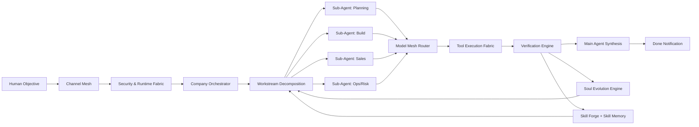

# SOVEREIGN X Architecture (Company of Agents)

This architecture is an evolution of the common local-agent stack:
- It is not only a tool runner.
- It is a self-organizing company of agents.
- Each agent has a soul, skills, and memory that evolve from outcomes.
- Human gives objective; system decomposes, debates, executes, verifies, and reports done.

## Core Flow

## Why It Is Better for Your Concept

1. Soul Engine
- Agents adapt mission, values, communication style, and risk tolerance from outcomes.

2. Skill Forge
- Agents create reusable skills from new tasks.
- Every skill keeps its own memory and performance signal.

3. Model Mesh
- Per-workstream model routing: small, standard, high-general, high-coding.
- Failover chain across providers.

4. Company Protocol
- Specialists run in parallel.
- Challenge/rebuttal rounds happen before final main-agent decision.

5. Human Experience
- User sets objective and receives completion signals.
- System handles decomposition and execution complexity internally.

## Implemented Endpoints

- `GET /api/architecture/blueprint`
- `POST /api/architecture/company-plan`
- `POST /api/architecture/soul/evolve`

## Execution Contract

For each objective:
1. Assign main agent (or auto-create).
2. Build workstreams from objective.
3. Assign or auto-spawn specialists.
4. Generate/reuse per-workstream skills.
5. Route model per stream.
6. Execute + verify.
7. Update soul and skill memory.
8. Notify human with outcome and evidence.
