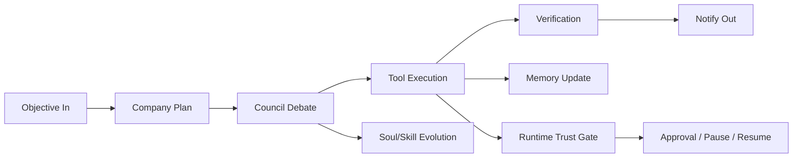

# Architecture

SOVEREIGN is built as a modular runtime:

- channel gateway
- security/runtime trust fabric
- company orchestrator
- council debate engine
- skill and soul subsystems
- memory engine (vector + keyword + graph relations)
- observability + evals
- heartbeat/autopilot loops

## High-Level Flow

## Key Execution Concepts

- Mission contract:
  - objective
  - KPI
  - deadline
  - policy preset
- Company run:
  - decomposes into workstreams
  - executes council-guided steps
  - logs evidence and telemetry
- Council run:
  - specialists debate and challenge assumptions
  - main agent produces final briefing

## Reliability Path

- Budget cap checked before expensive execution steps
- Timeouts protect lanes from stuck council calls
- Outbox retries make notifications durable
- Resume checkpoints restore paused runs

## Memory Path

- vector similarity for semantic recall
- keyword scoring for exact retrieval
- graph entities/relations for contextual links

## Integration Surfaces

- REST API (`/api/...`)
- Gateway WebSocket control plane (`/gateway/ws`) for session-to-session and node orchestration
- local and messaging channel adapters
- plugin tool SDK
- OpenAPI + SDK clients (TypeScript/Python)

## Gateway Runtime Additions

- Node registry + invoke model (`node.list`, `node.describe`, `node.invoke`)
- Device bridge protocol (`/bridge/ws`) for companion node register/heartbeat/invoke
- Managed browser control (Chrome/Chromium CDP bootstrap + target open/list)
- Tailscale exposure planning/apply (`off|serve|funnel`) with loopback safety checks
